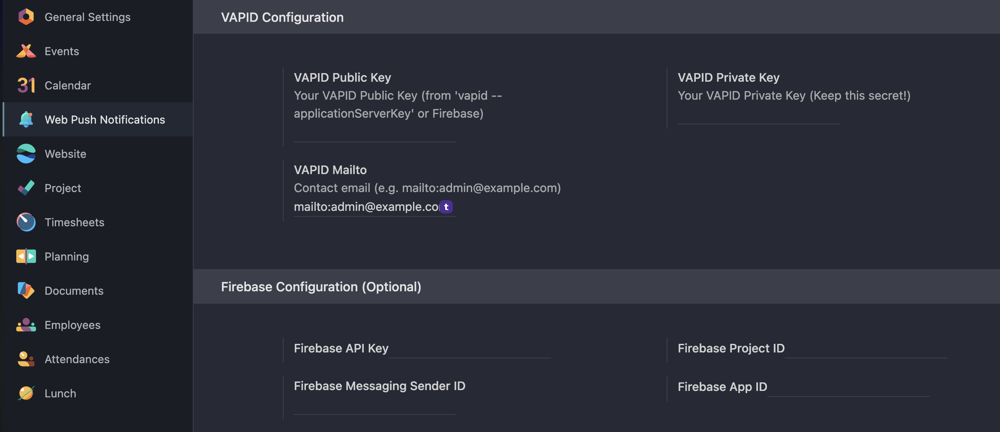

# Odoo Discuss Web Push Notifications

 

**Bring your Odoo 18 communication to life with real-time web push notifications.**

This module optimizes the standard Odoo Discuss (Mail) functionality to ensure reliable delivery of browser push notifications. It is designed to work seamlessly with the Odoo 18 web client and PWA features.

## 🚀 Key Features

* **Odoo 18 Optimization:** Tuned to work with the latest Odoo Bus and Longpolling architecture.
* **Native Browser Integration:** Uses standard Web Push API (Service Workers) to deliver notifications directly to Chrome, Firefox, Safari, and Edge.
* **Background Alerts:** Receive notifications even when you are working in another tab or application.
* **Instant Access:** Clicking the notification instantly opens the specific chat window or document in Odoo.

## 🛠 Installation

1.  **Clone the Repository:**
    ```bash
    cd /your/odoo/custom/addons
    git clone [https://github.com/metasamyar/odoo-custom-addons.git](https://github.com/metasamyar/odoo-custom-addons.git)
    ```

2.  **Restart Odoo:**
    ```bash
    # If using Docker
    docker restart odoo-container
    ```

3.  **Install the Module:**
    * Go to **Apps**.
    * Click **Update Apps List**.
    * Search for "Web Push Discuss".
    * Click **Activate**.

## ⚙️ Configuration

### HTTPS Requirement
**Important:** Web Push notifications **require HTTPS** (SSL) to function due to browser security policies.
* Ensure your Odoo instance is served over `https://`.
## 📸 Screenshots

### Settings Panel
Easy configuration in the settings menu:



## 📜 License

Distributed under the LGPL-3 License. See `LICENSE` for more information.